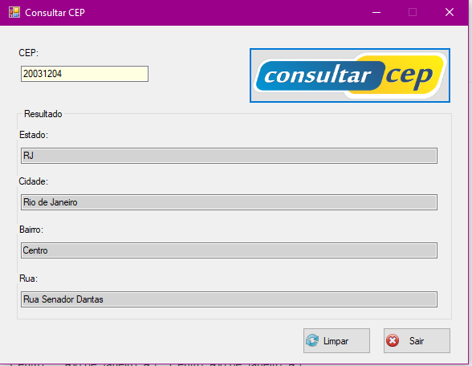

# ConsultaCEP

Sistema para consultar CEP utilizando WindowsForms.

Feito com base no curso da Udemy: C# e Windows Forms: Consultar CEP no WebService dos Correios.

Tela para consulta:

Resultado da consulta:

